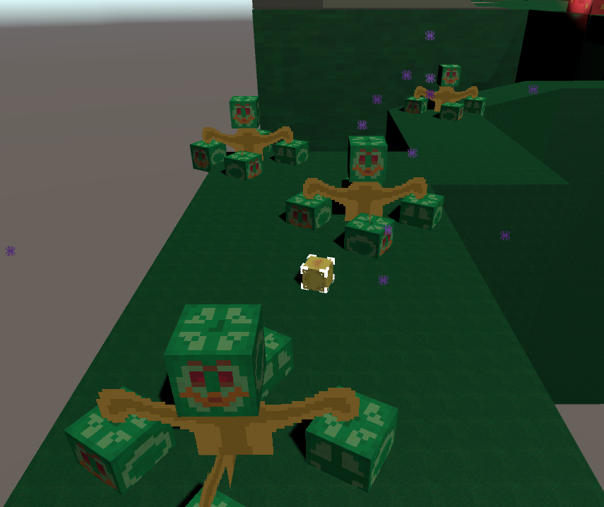
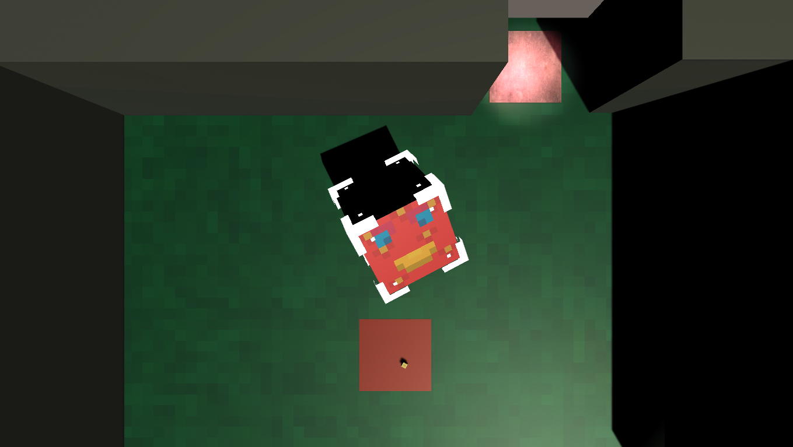

<h1>The Ultimate Bird-venture !<h1>
<u>Contrôles :</u>  
Z   Avancer 
Q   Gauche 
S   Reculer 
D   Droite 
Espace  Sauter 
E   Retour sur Birdy 
Clic Gauche     Contrôler le Bird créé 
   
<u>Le Jeu :</u> 

 

Vous incarnez Birdy, un petit oiseau jaune dans un jeu de Puzzle-Platformer
 

 

Mais attention à la chute qui vous téléportera en arrière !

 

Activez des boutons pour avancer

 

Mais attention aux méchants BirdMelon qui vous téléporteront en Arrière
 

 

 

Contrôlez divers Birds afin d'avancer dans le niveau

 

Mais attention, c'est à vos risques et périls !

